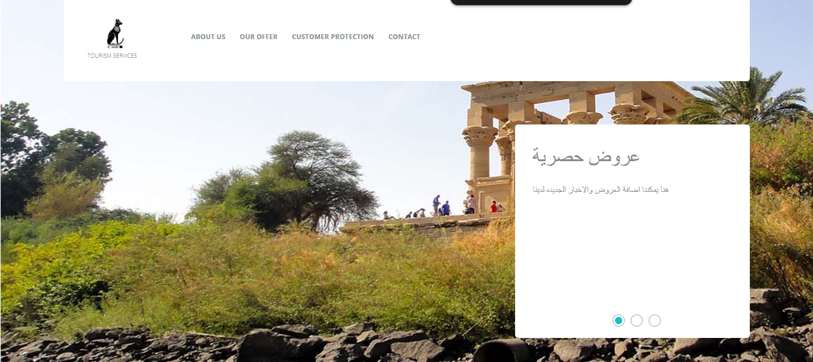
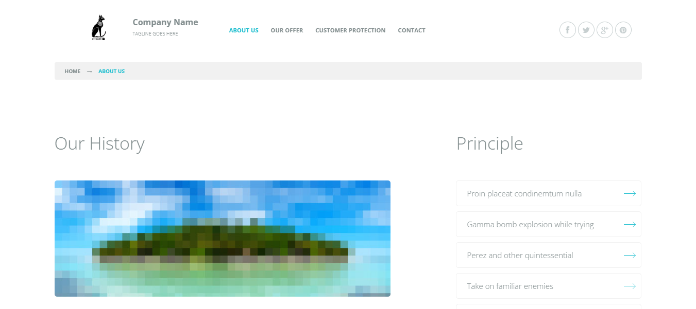

# 🌍 SaapTravel – موقع سياحي متكامل

[]()
[]()
[]()
[]()
[]()

---

## 📌 نظرة عامة
**SaapTravel** هو موقع سياحي متكامل مصمم باستخدام **HTML, Sass/CSS, JavaScript**، يتميز بتصميم عصري ومتجاوب مع مختلف الأجهزة.  
الموقع يهدف لتقديم أفضل العروض والخدمات السياحية بطريقة احترافية وجذابة.

---

### الصفحة الرئيسية


### صفحة "عنّا"



## 📂 الصفحات المتوفرة
- 🏠 **الصفحة الرئيسية** (`index.html`)
- ℹ️ **من نحن** (`about-us.html`)
- 💼 **عروضنا** (`our-offer.html`)
- 🛡 **حماية العميل** (`customer-protection.html`)
- 📩 **تواصل معنا** (`contact.html`)

---

## 🛠️ التقنيات المستخدمة
| التقنية        | الاستخدام                         |
|---------------|------------------------------------|
| **HTML5**     | بناء الهيكل الأساسي للصفحات        |
| **Sass / CSS**| تصميم واجهات متناسقة وجذابة        |
| **JavaScript**| إضافة التفاعلية للموقع            |
| **Git & GitHub** | التحكم في الإصدارات وحفظ الكود  |

---

## 🚀 كيفية التشغيل محليًا
1. استنسخ المشروع:
   ```bash
   git clone https://github.com/MajekAhmed/saaptravel.git
```

📬 تواصل معي
💼 LinkedIn: Ahmed Ragab Mohamed [`(https://www.linkedin.com/in/ahmed-ragab-mohmed/)`]

💻 GitHub: MajekAhmed

📄 الترخيص
هذا المشروع مرخّص تحت MIT License — يمكنك استخدامه أو تعديله بحرية مع ذكر المصدر.
